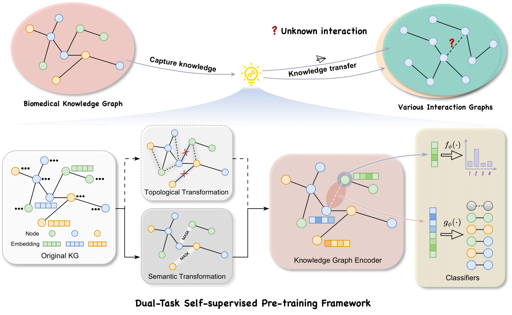

# 1. LukePi

This repo provides the source code & data of our paper:" **Learning Universal Knowledge Graph Embedding for Predicting Biomedical Pairwise Interactions**"

## 2. Overview

Here, we propose **LukePi** (**L**earning **u**niversal **k**nowledge graph **e**mbedding for predicting biomedical **P**airwise **i**nteractions), a novel self-supervised pre-training framework for predicting various types of biomedical interactions. Extensive experiments on two pairwise interaction tasks demonstrate LukePi’s outstanding predictive performance and strong generalizability.



## 3. File Tree

```
LukePi
|   README.md                                #README file                    
│   model.py                                 #knowledge graph encoder
│   loader_norm.py                         
│   util.py
│   pretrain_LukePi.py                       #a script for training LukePi
|─ pre_trained_model                         #store pre-trained model in this file
|  
|
├─data
|  |-BKG
|  |     node_index_dic.json                 # provide the node index map dictory
|  |     kgdata.pkl                          # provide the pre-training knowledge graph
|  |-SL
|        |C1                                 # SL data in vanilla splitting scenario
|        |C2                                 # SL data in weak cold start scenario
|        |C3                                 # SL data in cold start scenario
|
|-fintune_LukePi.py                          # finetune LukePi   
|-fintune_original.py                        # train the HGT model without pre-training
└─ test_LukePi.sh                            # a script used to test LukePi 
     
   ```


## 4. Main Requirements

To run this project, you will need the following packages:
- python=3.10
- pytorch==1.12.1 
- torchvision==0.13.1 
- cudatoolkit=11.3.1
- torch-cluster==1.5.7
- torch-geometric==1.6.0
- torch-scatter==2.1.0
- sparse==0.6.16


## 5. Training and Checkpoints

To pre-train our LukePi from scratch, navigate to `./src` and run the following command in your terminal:
```python
python pretrain_LukePi.py
```
The well-trained model will be stored in `./pre_trained_model`. 

We also provide a pre-trained model in the Google Driver (https://drive.google.com/drive/folders/1-IMvqc6O_6f4C9vjtFZC918dxycaOqGg?usp=sharing). If you are interested in one type of pairwise interaction problem, you can use this demo data for a quick try. 


## 6. Finetune LukePi

To qualitatively evalute the embeddings for predicting pairwise interactions, navigate to ```./src``` and run the following comman in your terminal:
```shell
bash test_LukePi.sh
```
The classification metrics will be stored in `./result`.

## 7. Notes
Due to the limitation of GitHub's file size (< 100mb), we upload the BKG data (`kgdata.pkl`) into Google Driver (https://drive.google.com/drive/folders/1-IMvqc6O_6f4C9vjtFZC918dxycaOqGg?usp=sharing). Please place it in the path of `./data/BKG` before running.

## 8. How to cite LukePi:
If our work contributes to your research, we kindly encourage you to cite it using the following reference:
```
@article{Tao2025,
  author = {Tao, Siyu and Yang, Yang and Liu, Xin and Feng, Yimiao and Zheng, Jie},
  title = {Learning Universal Knowledge Graph Embedding for Predicting Biomedical Pairwise Interactions},
  year = {2025},
  journal = {bioRxiv},
  doi = {10.1101/2025.02.10.637419}
}
```

